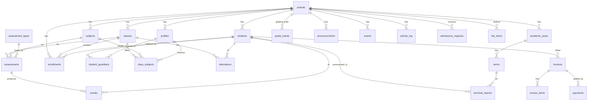

# 03 — Database Design

Version 1.0 · Status: Planning / MVP · Engine: PostgreSQL (Supabase)

This is the data-model **design**, not migration code. It defines tables, relationships,
enums, and the RLS strategy. Migrations in `supabase/migrations/` will implement it.

---

## 1. Principles

- **Multi-tenant:** every tenant-owned table has a non-null `school_id` FK to `schools`.
  Nothing tenant-owned exists without a school.
- **Auth identity lives in `auth.users`** (managed by Supabase). Application identity,
  role, and school membership live in **`profiles`** (1:1 with `auth.users`).
- **Students are records, not users** in the MVP — they have no login. Teachers, parents,
  and admins are users (rows in `profiles`).
- **RLS on every table.** The database, not the UI, decides who sees what.
- **UUID primary keys**, `created_at`/`updated_at` timestamps on mutable tables.
- **Authoritative membership** is via `enrollments` (student ↔ class ↔ year). Any
  "current class" shown in UI is derived from the active enrollment.

---

## 2. Entity relationship overview



---

## 3. Enums

| Enum | Values |
|---|---|
| `user_role` | `super_admin`, `school_admin`, `teacher`, `parent` |
| `gender` | `male`, `female`, `other` |
| `enrollment_status` | `active`, `inactive`, `graduated`, `withdrawn`, `transferred` |
| `attendance_status` | `present`, `absent`, `late` |
| `announcement_audience` | `everyone`, `parents`, `teachers` |
| `guardian_relationship` | `mother`, `father`, `guardian`, `other` |
| `inquiry_status` | `new`, `reviewing`, `accepted`, `rejected`, `converted` |
| `invoice_status` | `unpaid`, `partial`, `paid` |
| `payment_method` | `cash`, `bank_transfer`, `mobile_money`, `cheque`, `other` |

---

## 4. Core tables

### `schools`
The tenant root.

| Column | Type | Notes |
|---|---|---|
| id | uuid PK | |
| name | text | e.g. "Kiddiewise School Complex" |
| slug | text unique | for marketing site / subdomain |
| logo_url | text null | Storage path |
| address, phone, email | text null | contact |
| active_academic_year_id | uuid null FK → academic_years | one active year |
| active_term_id | uuid null FK → terms | one active term |
| created_at | timestamptz | |

### `profiles`
Application identity for every user. 1:1 with `auth.users` (`id` = `auth.users.id`).

| Column | Type | Notes |
|---|---|---|
| id | uuid PK / FK → auth.users.id | |
| school_id | uuid null FK → schools | null only for `super_admin` |
| role | user_role | drives portal + permissions |
| first_name, last_name | text | |
| email | text | mirror of auth email |
| phone | text null | |
| avatar_url | text null | |
| staff_no | text null | teacher only, e.g. `TCH-1` (unique per school) |
| department | text null | teacher only ("No Department" allowed) |
| is_active | boolean default true | |
| created_at | timestamptz | |

> Role-specific columns (`staff_no`, `department`) are nullable on `profiles` for MVP
> simplicity. If teacher/parent metadata grows, split into `teachers` / `parents`
> extension tables keyed on `profiles.id`.

### `students`
Student records (no login).

| Column | Type | Notes |
|---|---|---|
| id | uuid PK | |
| school_id | uuid FK | |
| admission_no | text | unique per school |
| first_name, last_name | text | |
| date_of_birth | date | |
| gender | gender | |
| photo_url | text null | |
| enrollment_status | enrollment_status default `active` | |
| created_at | timestamptz | |

Constraint: `unique (school_id, admission_no)`.

### `student_guardians`
Parent ↔ student link (many-to-many). Grants a parent read access to a child.

| Column | Type | Notes |
|---|---|---|
| id | uuid PK | |
| school_id | uuid FK | |
| student_id | uuid FK → students | |
| parent_profile_id | uuid FK → profiles (role=parent) | |
| relationship | guardian_relationship | |
| is_primary | boolean default false | |

Constraint: `unique (student_id, parent_profile_id)`.

---

## 5. Academic structure

### `academic_years`
| id | school_id FK | name ("2026/2027") | start_date | end_date | is_active bool |

Constraint: at most one `is_active = true` per school (enforced in app + partial unique index).

### `terms`
| id | school_id FK | academic_year_id FK | name ("First Term"…) | ordinal (1–3) | start_date | end_date | is_active bool |

At most one active term per school.

### `classes`
Persistent class definitions (membership handled via enrollments).

| Column | Type | Notes |
|---|---|---|
| id | uuid PK | |
| school_id | uuid FK | |
| name | text | e.g. "Basic 1", "JHS 2A" |
| level | text | e.g. "Primary", "JHS" (shown in Class Performance table) |
| capacity | int null | |
| class_teacher_id | uuid null FK → profiles (teacher) | homeroom teacher |
| created_at | timestamptz | |

### `subjects`
| id | school_id FK | name | code (null) |

Constraint: `unique (school_id, name)`.

### `class_subjects`
Which subject is taught in which class, and by whom. **This is the teacher assignment.**

| Column | Type | Notes |
|---|---|---|
| id | uuid PK | |
| school_id | uuid FK | |
| class_id | uuid FK | |
| subject_id | uuid FK | |
| teacher_id | uuid null FK → profiles (teacher) | assigned teacher |

Constraint: `unique (class_id, subject_id)`. Drives the teacher's "My Classes / My Subjects".

### `enrollments`
Authoritative student membership per class per year.

| Column | Type | Notes |
|---|---|---|
| id | uuid PK | |
| school_id | uuid FK | |
| student_id | uuid FK | |
| class_id | uuid FK | |
| academic_year_id | uuid FK | |
| status | enrollment_status default `active` | |
| enrolled_at | timestamptz | |

Constraint: `unique (student_id, academic_year_id)` (one class per student per year).
Promotion creates new rows for the next year.

---

## 6. Attendance

### `attendance`
| Column | Type | Notes |
|---|---|---|
| id | uuid PK | |
| school_id | uuid FK | |
| student_id | uuid FK | |
| class_id | uuid FK | |
| term_id | uuid FK | |
| date | date | |
| status | attendance_status | present / absent / late |
| marked_by | uuid FK → profiles | teacher |
| created_at, updated_at | timestamptz | |

Constraint: `unique (student_id, date)`. Attendance percentage per child is derived
(`present + late` counts vs total marked days) — expose via a view/RPC.

---

## 7. Assessments, results, grading

### `assessment_types`
Configurable graded categories (e.g. Class Test, Mid-Term, Exam) with weighting.

| id | school_id FK | name | weight numeric (percent toward term total) |

### `assessments`
A graded item created by a teacher for a class+subject in a term.

| Column | Type | Notes |
|---|---|---|
| id | uuid PK | |
| school_id | uuid FK | |
| class_id | uuid FK | |
| subject_id | uuid FK | |
| term_id | uuid FK | |
| assessment_type_id | uuid FK | |
| title | text | e.g. "End of Term Exam" |
| max_score | numeric | |
| date | date null | |
| created_by | uuid FK → profiles | |
| created_at | timestamptz | |

### `results`
Per-student score for an assessment.

| Column | Type | Notes |
|---|---|---|
| id | uuid PK | |
| school_id | uuid FK | |
| assessment_id | uuid FK | |
| student_id | uuid FK | |
| score | numeric | |
| grade | text null | derived from `grade_bands` |
| remark | text null | teacher comment |
| entered_by | uuid FK → profiles | |
| is_submitted | boolean default false | draft vs submitted |
| created_at, updated_at | timestamptz | |

Constraint: `unique (assessment_id, student_id)`.

### `grade_bands`
The school's grading scale (score range → grade → remark). Ghana schools often use WAEC-style
bands (A1–F9); keep it configurable per school.

| id | school_id FK | min_score numeric | max_score numeric | grade text ("A1") | remark text ("Excellent") |

### `terminal_reports`
Per-student, per-term aggregate (the report card parents view / admins export).

| Column | Type | Notes |
|---|---|---|
| id | uuid PK | |
| school_id | uuid FK | |
| student_id | uuid FK | |
| class_id | uuid FK | |
| term_id | uuid FK | |
| academic_year_id | uuid FK | |
| total_score, average_score | numeric | |
| position | int null | rank in class |
| attendance_present, attendance_total | int | summary |
| class_teacher_comment | text null | |
| head_teacher_comment | text null | |
| pdf_url | text null | Storage path (`reports` bucket) |
| is_published | boolean default false | parents see only when published |
| generated_at | timestamptz | |

Constraint: `unique (student_id, term_id)`.

---

## 8. Communication & activity

### `announcements`
| id | school_id FK | title | body | audience (announcement_audience) | is_published bool | published_at | created_by FK | created_at |

### `events`
Calendar / "Upcoming Events".
| id | school_id FK | title | description null | start_at | end_at null | location null | created_by FK | created_at |

### `activity_log`
Feeds "Recent Activities".
| id | school_id FK | actor_id FK → profiles | action text | entity_type text | entity_id uuid null | meta jsonb null | created_at |

### `admissions_inquiries`
From the marketing Admissions/Contact forms.
| id | school_id FK | applicant_name | parent_name | parent_email | parent_phone | desired_class text null | message text null | status (inquiry_status) default `new` | created_at |

---

## 9. Fees (lightweight)

No payment gateway in MVP — invoices and manually recorded payments only.

### `fee_items`
Reusable fee definitions.
| id | school_id FK | name ("Term 1 Tuition") | amount numeric | class_id null FK (null = all/level) | academic_year_id FK | term_id null FK |

### `invoices`
| Column | Type | Notes |
|---|---|---|
| id | uuid PK | |
| school_id | uuid FK | |
| student_id | uuid FK | |
| academic_year_id | uuid FK | |
| term_id | uuid FK | |
| total_amount | numeric | |
| amount_paid | numeric default 0 | maintained on payment |
| status | invoice_status default `unpaid` | derived: unpaid/partial/paid |
| due_date | date null | |
| created_at | timestamptz | |

### `invoice_items`
| id | school_id FK | invoice_id FK | fee_item_id null FK | description | amount numeric |

### `payments`
| id | school_id FK | invoice_id FK | student_id FK | amount numeric | method (payment_method) | reference text null | paid_at timestamptz | recorded_by FK → profiles |

Dashboard **Total Revenue** = `sum(payments.amount)` for the active year; **Fee Collection
Trend** = payments grouped by month. Expose via SQL views/RPC, not client-side aggregation.

---

## 10. RLS strategy

RLS is enabled on **every** table. Two helper functions (SECURITY DEFINER, reading the
caller's `profiles` row) back all policies:

- `current_school_id()` → the caller's `school_id`
- `current_role()` → the caller's `user_role`

### Baseline tenant policy (applies to all tenant tables)
```
USING ( school_id = current_school_id() )
```
Reads and writes are confined to the caller's school. `super_admin` gets an additional
bypass policy on platform-level tables (`schools`, platform settings) only.

### Role-specific write policies (in addition to tenancy)

| Table | school_admin | teacher | parent |
|---|---|---|---|
| students, classes, subjects, class_subjects, enrollments, academic_years, terms, fee_*, invoices, payments, announcements, events, admissions_inquiries, grade_bands, assessment_types | full CRUD | read (own assignments) | — |
| attendance | full | insert/update **only for classes they are assigned to** | — |
| assessments | full | insert/update **for their class_subjects** | — |
| results | full | insert/update **for their assessments** | — |
| terminal_reports | full (+ publish) | read (own classes) | read **published** for own children |
| profiles | manage school users | read self + colleagues (limited) | read self |

### Parent read scope
A parent can read a `student` (and that student's `enrollments`, `attendance`, `results`,
published `terminal_reports`, and relevant `announcements`) **only if** a `student_guardians`
row links that student to the parent's `profiles.id`. Policies express this with an
`EXISTS (SELECT 1 FROM student_guardians sg WHERE sg.student_id = <row>.student_id AND
sg.parent_profile_id = auth.uid())` check, always combined with the tenancy predicate.

### Teacher write scope
Teacher writes to `attendance`/`assessments`/`results` require an `EXISTS` check against
`class_subjects` (or `classes.class_teacher_id`) proving the teacher is assigned to that
class/subject.

### Public (unauthenticated) writes
Marketing forms insert into `admissions_inquiries` for a specific `school_id`. This is the
one anonymous write path; it is INSERT-only, rate-limited at the edge, and never readable by
anon.

---

## 11. Indexes & constraints (highlights)

- `school_id` indexed on every tenant table (all queries filter by it).
- Uniques: `(school_id, admission_no)`, `(school_id, name)` on subjects, `(student_id, date)`
  on attendance, `(assessment_id, student_id)` on results, `(student_id, academic_year_id)`
  on enrollments, `(student_id, term_id)` on terminal_reports, `(staff_no per school)`.
- Partial unique for single active year/term per school.
- FKs `ON DELETE`: prefer `RESTRICT`/`SET NULL` over cascade for academic records to avoid
  accidental data loss; soft-delete (status flags) preferred over hard delete for students.

---

## 12. Derived data (views / RPC)

Provide read-only views or RPC functions for dashboard aggregates so the client never
aggregates sensitive data itself:

- `dashboard_stats(school_id)` — totals: students, staff, revenue, attendance rate.
- `enrollment_trend(school_id)` — enrollments per month.
- `fee_collection_trend(school_id)` — payments per month.
- `class_performance(school_id)` — per class: student count + average score.
- `student_attendance_summary(student_id, term_id)` — present/total → percentage.

All respect RLS (defined as SECURITY INVOKER where possible).
