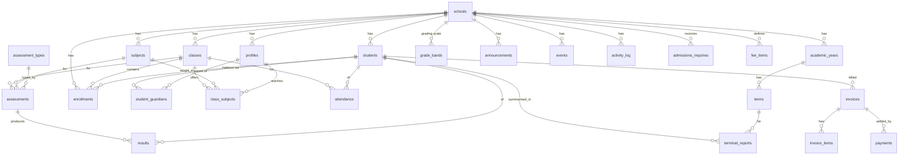

# 03 — Database Design

Version 1.1 · Status: reflects the wired backend · Engine: PostgreSQL (Supabase)

This is the data-model **design**, not migration code. It defines tables, relationships,
enums, and the RLS strategy. Migrations in `supabase/migrations/` will implement it.

---

## 1. Principles

- **Multi-tenant:** every tenant-owned table has a non-null `school_id` FK to `schools`.
  Nothing tenant-owned exists without a school.
- **Auth identity lives in `auth.users`** (managed by Supabase). Application identity,
  role, and school membership live in **`profiles`** (1:1 with `auth.users`).
- **Students are records, not users** in the MVP — they have no login. Teachers, parents,
  and admins are users (rows in `profiles`).
- **RLS on every table.** The database, not the UI, decides who sees what.
- **UUID primary keys**, `created_at`/`updated_at` timestamps on mutable tables.
- **Authoritative membership** is via `enrollments` (student ↔ class ↔ year). Any
  "current class" shown in UI is derived from the active enrollment.

---

## 2. Entity relationship overview



---

## 3. Enums

| Enum | Values |
|---|---|
| `user_role` | `super_admin`, `school_admin`, `teacher`, `parent` |
| `gender` | `male`, `female`, `other` |
| `enrollment_status` | `active`, `inactive`, `graduated`, `withdrawn`, `transferred` |
| `attendance_status` | `present`, `absent`, `late` |
| `announcement_audience` | `everyone`, `parents`, `teachers` |
| `guardian_relationship` | `mother`, `father`, `guardian`, `other` |
| `inquiry_status` | `new`, `reviewing`, `accepted`, `rejected`, `converted` |
| `payment_method` | `cash`, `bank_transfer`, `mobile_money`, `cheque`, `other` |
| `blood_group` | `A+`, `A-`, `B+`, `B-`, `AB+`, `AB-`, `O+`, `O-` (0016) |
| `fee_term` | `full_year`, `first`, `second`, `third` (0017) |
| `scholarship_type` | `none`, `partial`, `full`, `bursary` (0017) |
| `extra_fee_frequency` | `one_time`, `termly`, `monthly`, `annual` (0017) |

> `invoice_status` was **dropped** in 0017 along with `invoices.status`. Payment state is derived
> from `payments`, never stored — see §9.

---

## 4. Core tables

### `schools`
The tenant root.

| Column | Type | Notes |
|---|---|---|
| id | uuid PK | |
| name | text | e.g. "Kiddiewise School Complex" |
| slug | text unique | for marketing site / subdomain |
| logo_url | text null | Storage path |
| address, phone, email | text null | contact |
| active_academic_year_id | uuid null FK → academic_years | one active year |
| active_term_id | uuid null FK → terms | one active term |
| ca_weight | int default 50 | continuous-assessment weight on the report card; the exam weight is always `100 - ca_weight`, so the two can never disagree |
| pass_mark | int default 50 | what counts on the card's "Number Of Passes" line — the grading scale can't say it, because which band is the lowest PASS is the school's call |
| created_at | timestamptz | |

### `profiles`
Application identity for every user. 1:1 with `auth.users` (`id` = `auth.users.id`).

| Column | Type | Notes |
|---|---|---|
| id | uuid PK / FK → auth.users.id | |
| school_id | uuid null FK → schools | null only for `super_admin` |
| role | user_role | drives portal + permissions |
| first_name, last_name | text | |
| email | text | mirror of auth email |
| phone | text null | |
| avatar_url | text null | |
| staff_no | text null | teacher only, e.g. `TCH-1` (unique per school) |
| department | text null | teacher only ("No Department" allowed) |
| is_active | boolean default true | |
| created_at | timestamptz | |
| occupation | text null | guardians (0016) |
| position | text null | free-text job title, e.g. "Head Teacher" — distinct from `role` (0019) |
| gender | gender null | staff (0019) |
| date_of_birth | date null | staff (0019) |
| hire_date | date null | staff (0019) |
| qualification | text null | staff (0019) |
| must_change_password | boolean default false | an admin-issued temporary password is in force (0020) |
| temp_password_expires_at | timestamptz null | when that temporary password stops working (0020) |
| password_changed_at | timestamptz null | set when the holder replaces it — i.e. the account is theirs (0020) |

> The last three are **not grantable to `authenticated`**. `profiles_self_update` lets a user edit
> their own row, so a writable `must_change_password` would let the holder clear the flag and skip
> the forced change. Only the service role and `complete_password_change()` (§12) may write them.

> Role-specific columns (`staff_no`, `department`) are nullable on `profiles` for MVP
> simplicity. If teacher/parent metadata grows, split into `teachers` / `parents`
> extension tables keyed on `profiles.id`.

### `students`
Student records (no login).

| Column | Type | Notes |
|---|---|---|
| id | uuid PK | |
| school_id | uuid FK | |
| admission_no | text | unique per school |
| first_name, last_name | text | |
| date_of_birth | date | |
| gender | gender | |
| photo_url | text null | |
| enrollment_status | enrollment_status default `active` | |
| created_at | timestamptz | |
| other_names | text null | 0016 |
| blood_group | blood_group null | 0016 |
| enrollment_date | date null | 0016 |
| medical_conditions, allergies | text null | 0016 |
| prev_school_name, prev_class_ended, prev_year_attended | text null | 0016 |
| prev_average_score | text null | free-form on purpose — prior-school reporting isn't standardised ("72%", "B+", "N/A") (0016) |
| email, phone, address, city, town | text null | the student's own or the household's (0016) |
| initial_academic_year_id | uuid null FK → academic_years | year first admitted; distinct from the current enrollment (0016) |
| initial_term_id | uuid null FK → terms | as above (0016) |

Constraint: `unique (school_id, admission_no)`.

> A student's **class is not a column here** — it comes from their active `enrollments` row, so a
> promotion is one enrollment write rather than an edit that destroys history.

### `student_guardians`
Parent ↔ student link (many-to-many). Grants a parent read access to a child.

| Column | Type | Notes |
|---|---|---|
| id | uuid PK | |
| school_id | uuid FK | |
| student_id | uuid FK → students | |
| parent_profile_id | uuid FK → profiles (role=parent) | |
| relationship | guardian_relationship | |
| is_primary | boolean default false | |

Constraint: `unique (student_id, parent_profile_id)`.

---

## 5. Academic structure

### `academic_years`
| id | school_id FK | name ("2026/2027") | start_date | end_date | is_active bool |

Constraint: at most one `is_active = true` per school (enforced in app + partial unique index).

### `terms`
| id | school_id FK | academic_year_id FK | name ("First Term"…) | ordinal (1–3) | start_date | end_date | is_active bool |

At most one active term per school.

### `classes`
Persistent class definitions (membership handled via enrollments).

| Column | Type | Notes |
|---|---|---|
| id | uuid PK | |
| school_id | uuid FK | |
| name | text | e.g. "Basic 1", "JHS 2A" |
| level | text | e.g. "Primary", "JHS" (shown in Class Performance table) |
| capacity | int null | |
| class_teacher_id | uuid null FK → profiles (teacher) | homeroom teacher |
| created_at | timestamptz | |

### `subjects`
| id | school_id FK | name | code (null) |

Constraint: `unique (school_id, name)`.

### `class_subjects`
Which subject is taught in which class, and by whom. **This is the teacher assignment.**

| Column | Type | Notes |
|---|---|---|
| id | uuid PK | |
| school_id | uuid FK | |
| class_id | uuid FK | |
| subject_id | uuid FK | |
| teacher_id | uuid null FK → profiles (teacher) | assigned teacher |

Constraint: `unique (class_id, subject_id)`. Drives the teacher's "My Classes / My Subjects".

### `enrollments`
Authoritative student membership per class per year.

| Column | Type | Notes |
|---|---|---|
| id | uuid PK | |
| school_id | uuid FK | |
| student_id | uuid FK | |
| class_id | uuid FK | |
| academic_year_id | uuid FK | |
| status | enrollment_status default `active` | |
| enrolled_at | timestamptz | |

Constraint: `unique (student_id, academic_year_id)` (one class per student per year).
Promotion creates new rows for the next year.

---

## 6. Attendance

### `attendance`
| Column | Type | Notes |
|---|---|---|
| id | uuid PK | |
| school_id | uuid FK | |
| student_id | uuid FK | |
| class_id | uuid FK | |
| term_id | uuid FK | |
| date | date | |
| status | attendance_status | present / absent / late |
| marked_by | uuid FK → profiles | teacher |
| created_at, updated_at | timestamptz | |

Constraint: `unique (student_id, date)`. Attendance percentage per child is derived
(`present + late` counts vs total marked days) — expose via a view/RPC.

---

## 7. Assessments, results, grading

### `assessment_types`
Configurable graded categories (e.g. Class Test, Mid-Term, Exam) with weighting.

| id | school_id FK | name | weight numeric (percent toward term total) |

### `assessments`
A graded item created by a teacher for a class+subject in a term.

| Column | Type | Notes |
|---|---|---|
| id | uuid PK | |
| school_id | uuid FK | |
| class_id | uuid FK | |
| subject_id | uuid FK | |
| term_id | uuid FK | |
| assessment_type_id | uuid FK | |
| title | text | e.g. "End of Term Exam" |
| max_score | numeric | |
| date | date null | |
| created_by | uuid FK → profiles | |
| created_at | timestamptz | |

### `results`
Per-student score for an assessment.

| Column | Type | Notes |
|---|---|---|
| id | uuid PK | |
| school_id | uuid FK | |
| assessment_id | uuid FK | |
| student_id | uuid FK | |
| score | numeric | |
| grade | text null | **always written NULL** — see the note below |
| remark | text null | **always written NULL** — this was the grading-band remark, not the teacher's |
| teacher_comment | text null | the subject teacher's own note (0019) |
| entered_by | uuid FK → profiles | the caller, never client input |
| is_submitted | boolean default false | draft vs submitted |
| created_at, updated_at | timestamptz | |

Constraint: `unique (assessment_id, student_id)` — which is what makes a mark sheet **editable**:
re-saving corrects a mark instead of duplicating it.

> **`grade`/`remark` are deliberately never populated.** Every screen derives the grade from the
> school's *current* bands at read time (`lib/results.ts`), so correcting the scale re-grades every
> existing mark at once instead of needing a backfill. Storing it too produced rows that
> contradicted themselves — a score corrected from 53 to 91 kept its old grade of `D`. The action
> now nulls both explicitly, because an upsert leaves untouched columns as they were.
>
> Both columns are candidates for a future `drop column`; nothing reads them.
>
> A blank score writes **no row at all** — "not marked yet" (a student absent for the test) is not
> a zero, and conflating them would turn absences into fails on report cards.

### `grade_bands`
The school's grading scale (score range → grade → remark). Ghana schools often use WAEC-style
bands (A1–F9); keep it configurable per school.

| id | school_id FK | min_score numeric | max_score numeric | grade text ("A1") | remark text ("Excellent") |

### `terminal_reports`
Per-student, per-term aggregate — the report card parents view and the school prints. Every figure
here is a SNAPSHOT taken at generation, unlike `results.grade` which is always derived: a published
report is the official record of a term and must not change because a mark was edited afterwards.

| Column | Type | Notes |
|---|---|---|
| id | uuid PK | |
| school_id | uuid FK | |
| student_id | uuid FK | |
| class_id | uuid FK | |
| term_id | uuid FK | |
| academic_year_id | uuid FK | |
| total_score, average_score | numeric | one decimal, as the card prints them |
| position | int null | rank in class; printed as `position/enrolled_count` |
| passes | int null | subjects at or above `schools.pass_mark` |
| class_average, class_lowest_average, class_highest_average | numeric null | the class's spread, so a parent can place their child's average |
| level_position, level_size | int null | rank across every class sharing `classes.level` |
| enrolled_count | int null | "number on roll" when the report was generated |
| attendance_present, attendance_total | int | summary |
| conduct, attitude, interest, promoted_to | text null | the class teacher's per-child fields |
| class_teacher_comment | text null | |
| head_teacher_comment | text null | |
| pdf_url | text null | Storage path (`reports` bucket) |
| is_published | boolean default false | parents see only when published |
| generated_at | timestamptz | |

Constraint: `unique (student_id, term_id)`.

### `terminal_report_subjects`
One frozen row per subject on a report card — the twelve-column table the paper form prints.
Replaced wholesale on regeneration, so a subject dropped from the class disappears from the card.

| Column | Type | Notes |
|---|---|---|
| id | uuid PK | |
| school_id, report_id, student_id | uuid FK | `report_id` cascades |
| subject_id | uuid FK null | |
| subject_name, short_code | text | snapshot by VALUE — renaming or re-coding a subject must not rewrite an issued card |
| class_score, exam_score, total | numeric null | the CA/exam split; a missing component is null, never 0 |
| class_average, class_lowest, class_highest | numeric null | how the rest of the class did in this subject |
| grade, remark | text null | from the school's `grade_bands` at generation |
| position | int null | rank in this subject |

Constraint: `unique (report_id, subject_name)`.

---

## 8. Communication & activity

### `announcements`
| id | school_id FK | title | body | audience (announcement_audience) | is_published bool | published_at | created_by FK | created_at |

### `events`
Calendar / "Upcoming Events".
| id | school_id FK | title | description null | start_at | end_at null | location null | created_by FK | created_at |

### `activity_log`
Feeds "Recent Activities".
| id | school_id FK | actor_id FK → profiles | action text | entity_type text | entity_id uuid null | meta jsonb null | created_at |

### `admissions_inquiries`
From the marketing Admissions/Contact forms.
| id | school_id FK | applicant_name | parent_name | parent_email | parent_phone | desired_class text null | message text null | status (inquiry_status) default `new` | created_at |

---

## 9. Fees (lightweight)

No payment gateway in MVP — invoices and manually recorded payments only.

> **`payments` is the single source of truth for money received.** 0017 **dropped**
> `invoices.amount_paid` and `invoices.status` (and the `invoice_status` enum): they restated what
> `payments` already knows, which is exactly what principle 9 forbids. Paid, balance and status are
> derived by the two views in §9.5 and by the pure `lib/fees/summary.ts` helper.

### `fee_items`
Reusable fee definition for a class + year + term scope.

| Column | Type | Notes |
|---|---|---|
| id | uuid PK | |
| school_id | uuid FK | |
| name | text | |
| amount | numeric | `check (amount > 0)` |
| class_id | uuid FK | **NOT NULL** since 0017 — school-wide charges are `extra_fee_items` instead |
| academic_year_id | uuid FK | |
| fee_term | fee_term default `full_year` | replaced `term_id`: a full-year fee spans every term, so a single term FK couldn't express it |
| due_date | date null | |
| late_fee | numeric null | `check (late_fee is null or late_fee >= 0)` |
| description | text null | |
| is_mandatory | boolean default true | |

### `invoices`
One student's fee position for a (year, fee_term) scope.

| Column | Type | Notes |
|---|---|---|
| id | uuid PK | |
| school_id | uuid FK | |
| student_id | uuid FK | |
| academic_year_id | uuid FK | |
| term_id | uuid **null** FK | null for a full-year invoice, which belongs to no single term |
| fee_term | fee_term default `full_year` | 0017 |
| total_amount | numeric | the net expected amount, after `discount` |
| discount | numeric default 0 | a **cedi amount**, not a percentage. The assign dialog collects a percent; the action resolves it, so the figure stays correct if the gross fee is later edited |
| arrears | numeric default 0 | carried forward; tracked separately so the UI can show it as its own column |
| scholarship_type | scholarship_type default `none` | 0017 |
| due_date | date null | |
| created_at | timestamptz | |

Constraint: `unique (student_id, academic_year_id, fee_term)` — so bulk-assign upserts idempotently.

### `invoice_items`
| id | school_id FK | invoice_id FK | fee_item_id null FK | description | amount numeric |

### `extra_fee_items` (0017)
Optional charges outside the core class fee — bus, feeding, uniform, excursion.

| id | school_id FK | name | description null | amount numeric `> 0` | frequency (extra_fee_frequency) | class_id **null** FK (null = all classes) | created_at |

Constraint: `unique (school_id, name)`.

### `extra_fee_assignments` (0017)
| id | school_id FK | student_id FK | extra_fee_item_id FK | amount numeric `> 0` | created_at |

`amount` is copied off the item at assign time and then editable per student: a sibling discount or a
part-term joiner pays something different from the list price. Constraint:
`unique (extra_fee_item_id, student_id)`.

### `payments`
| id | school_id FK | invoice_id **null** FK | extra_fee_assignment_id **null** FK | student_id FK | amount numeric `> 0` | method (payment_method) | reference text null | paid_at timestamptz | recorded_by FK → profiles |

Constraint `payments_one_target`: `(invoice_id is not null) <> (extra_fee_assignment_id is not null)`.
Exactly one target — a payment settles an invoice or an extra fee, never both, never neither.
Recording money against nothing is untraceable, which is the failure mode paper receipts have.

### 9.5 Derived fee views (0018)

Both are `security_invoker = true`. **This is load-bearing**: without it a view runs with its
owner's rights (`postgres`), bypassing RLS on every underlying table and handing any authenticated
caller the whole platform's fee ledger.

- **`student_fee_positions`** — one row per invoice with `paid` (summed from `payments`), `balance`
  (`greatest(0, total_amount + arrears - paid)`) and `status` (`paid` / `partial` / `pending`), plus
  the student's name and the class from the enrollment **for that invoice's own year**, so a promoted
  student's historical invoices still show the class they were in when the fee was raised.
- **`extra_fee_positions`** — the same derivation for assigned extra fees.

Dashboard **Total Revenue** = `sum(payments.amount)`; **Fee Collection Trend** = payments grouped by
month (§12). The Overview cards are summed by the pure, unit-tested `summarizeFees` helper rather than
a second SQL aggregate — one implementation of the arithmetic, not two that can drift.

---

## 10. RLS strategy

RLS is enabled on **every** table. Two helper functions (SECURITY DEFINER, reading the
caller's `profiles` row) back all policies:

- `current_school_id()` → the caller's `school_id`
- `current_role()` → the caller's `user_role`

### Baseline tenant policy (applies to all tenant tables)
```
USING ( school_id = current_school_id() )
```
Reads and writes are confined to the caller's school. `super_admin` gets an additional
bypass policy on platform-level tables (`schools`, platform settings) only.

### Role-specific write policies (in addition to tenancy)

| Table | school_admin | teacher | parent |
|---|---|---|---|
| students, classes, subjects, class_subjects, enrollments, academic_years, terms, fee_*, invoices, payments, announcements, events, admissions_inquiries, grade_bands, assessment_types | full CRUD | read (own assignments) | — |
| attendance | full | insert/update **only for classes they are assigned to** | — |
| assessments | full | insert/update **for their class_subjects** | — |
| results | full | insert/update **for their assessments** | — |
| terminal_reports | full (+ publish) | read (own classes) | read **published** for own children |
| profiles | manage school users | read self + colleagues (limited) | read self |

### Parent read scope
A parent can read a `student` (and that student's `enrollments`, `attendance`, `results`,
published `terminal_reports`, and relevant `announcements`) **only if** a `student_guardians`
row links that student to the parent's `profiles.id`. Policies express this with an
`EXISTS (SELECT 1 FROM student_guardians sg WHERE sg.student_id = <row>.student_id AND
sg.parent_profile_id = auth.uid())` check, always combined with the tenancy predicate.

### Teacher write scope
Teacher writes to `attendance`/`assessments`/`results` require an `EXISTS` check against
`class_subjects` (or `classes.class_teacher_id`) proving the teacher is assigned to that
class/subject.

### Public (unauthenticated) writes
Marketing forms insert into `admissions_inquiries` for a specific `school_id`. This is the
one anonymous write path; it is INSERT-only, rate-limited at the edge, and never readable by
anon.

---

## 11. Indexes & constraints (highlights)

- `school_id` indexed on every tenant table (all queries filter by it).
- Uniques: `(school_id, admission_no)`, `(school_id, name)` on subjects, `(student_id, date)`
  on attendance, `(assessment_id, student_id)` on results, `(student_id, academic_year_id)`
  on enrollments, `(student_id, term_id)` on terminal_reports, `(staff_no per school)`.
- Partial unique for single active year/term per school.
- FKs `ON DELETE`: prefer `RESTRICT`/`SET NULL` over cascade for academic records to avoid
  accidental data loss; soft-delete (status flags) preferred over hard delete for students.

---

## 12. Derived data (views / RPC)

**Principle: derive, don't duplicate.** Any number that summarises other rows is computed on
read, never stored as a second copy that could drift. These same derivations back **multiple
portals** off one set of base tables — e.g. `attendance` feeds the teacher roster, the parent's
`student_attendance_summary`, and the school-wide attendance rate in `dashboard_stats`; a single
upsert updates all three because none of them holds an independent copy (see
`docs/02-ARCHITECTURE.md` §3, "Cross-portal data flow & consistency").

Provide read-only views or RPC functions for aggregates so the client never aggregates sensitive
data itself:

| Function | Returns | Added |
|---|---|---|
| `dashboard_stats()` | totals: students, staff, revenue, attendance rate | 0013 |
| `enrollment_trend()` | enrollments per month | 0013 |
| `fee_collection_trend()` | payments per month | 0013 |
| `class_performance()` | per class: student count + average score | 0013 |
| `student_attendance_summary(student_id, term_id)` | present/total → percentage | 0013 |
| `dashboard_trends()` | month-over-month deltas behind the stat-card trend pills | 0018 |
| `sidebar_counts()` | students / staff / new inquiries, in one round trip | 0018 |
| `complete_password_change()` | clears `must_change_password` for `auth.uid()` | 0020 |

Plus the two derived fee **views** in §9.5.

`dashboard_trends()` is worth a note: `students`, `staff` and `revenue` are **relative** percent
changes, but `attendance` is a **percentage-point difference**, because it is already a rate —
reporting "attendance up 4%" when it moved 92% → 96% would be wrong twice over. Every branch guards
division by zero and returns 0, so the UI never special-cases a school's first month.

`complete_password_change()` is the one `SECURITY DEFINER` function here, because `authenticated`
deliberately has no UPDATE grant on the columns it touches. It takes **no arguments** and is
hard-scoped to `auth.uid()`, so it cannot be pointed at another account.

Everything else is SECURITY INVOKER, so each derivation returns only the caller's scope.

Some derivations deliberately live in **pure `lib/` helpers** rather than SQL, which principle 9
explicitly permits: `summarizeFees` (fee overview cards), `computeStudentStats`,
`aggregateSubjectResults`, `assignPositions`. They are unit-tested without a database, and being in
one place means the arithmetic cannot drift between the screens that show it.

---

## 13. Migration log

`supabase/migrations/` is the source of truth. 0001–0015 established the schema, RLS and grants.
0016–0021 closed drift between the schema and the UI that had been built against the seam:

| Migration | What it did |
|---|---|
| `0016_students_profiles_catchup` | 16 student columns (bio, contact, medical, previous school, intake year/term), `profiles.occupation`, single-primary-guardian index |
| `0017_fees_catchup` | `fee_term`/`scholarship_type`/`extra_fee_frequency` enums, discounts + arrears, `extra_fee_items` + `extra_fee_assignments`, payments settle either target. **Dropped** `invoices.amount_paid`, `invoices.status`, `invoice_status` |
| `0018_fees_views_dashboard_rpc` | `student_fee_positions` + `extra_fee_positions` views, `dashboard_trends()`, `sidebar_counts()` |
| `0019_staff_profile_results_comment` | staff employment record on `profiles`, `results.teacher_comment` |
| `0020_temp_password_activation` | `must_change_password`, `temp_password_expires_at`, `password_changed_at`, `complete_password_change()` |
| `0021_parent_read_assessments` | `asm_parent_read` — the missing policy that left the parent results page permanently empty |

> **Grants are not a standing rule.** 0015's `grant … on all tables in schema public` applied only to
> the tables that existed when it ran. Every migration that creates a table, or adds a user-editable
> column to `profiles`, must issue its own grants — otherwise requests fail at the privilege layer
> *before* RLS is consulted, which surfaces as a confusing empty result rather than a permission error.
