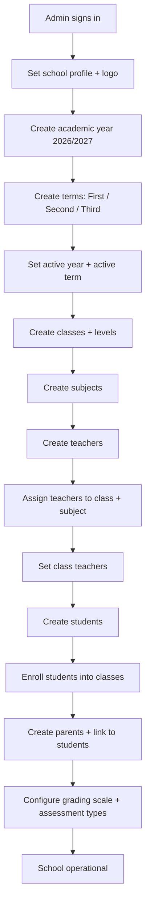
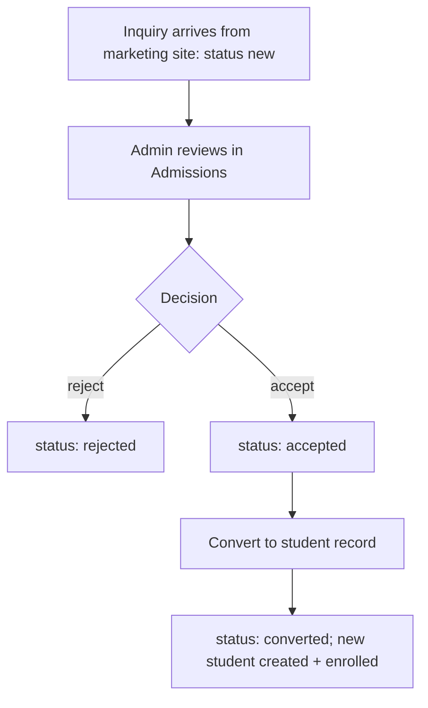
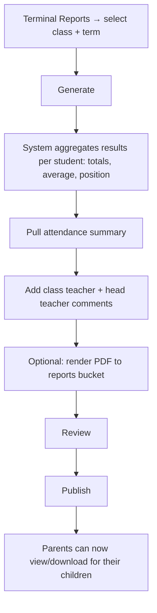
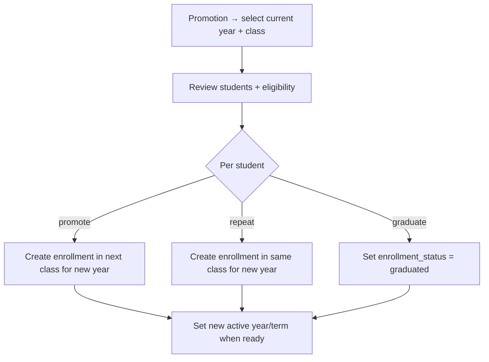
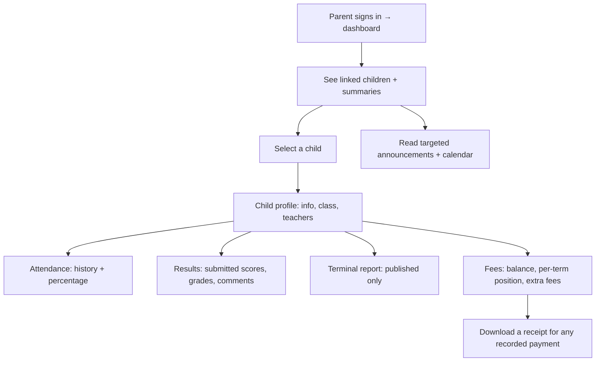
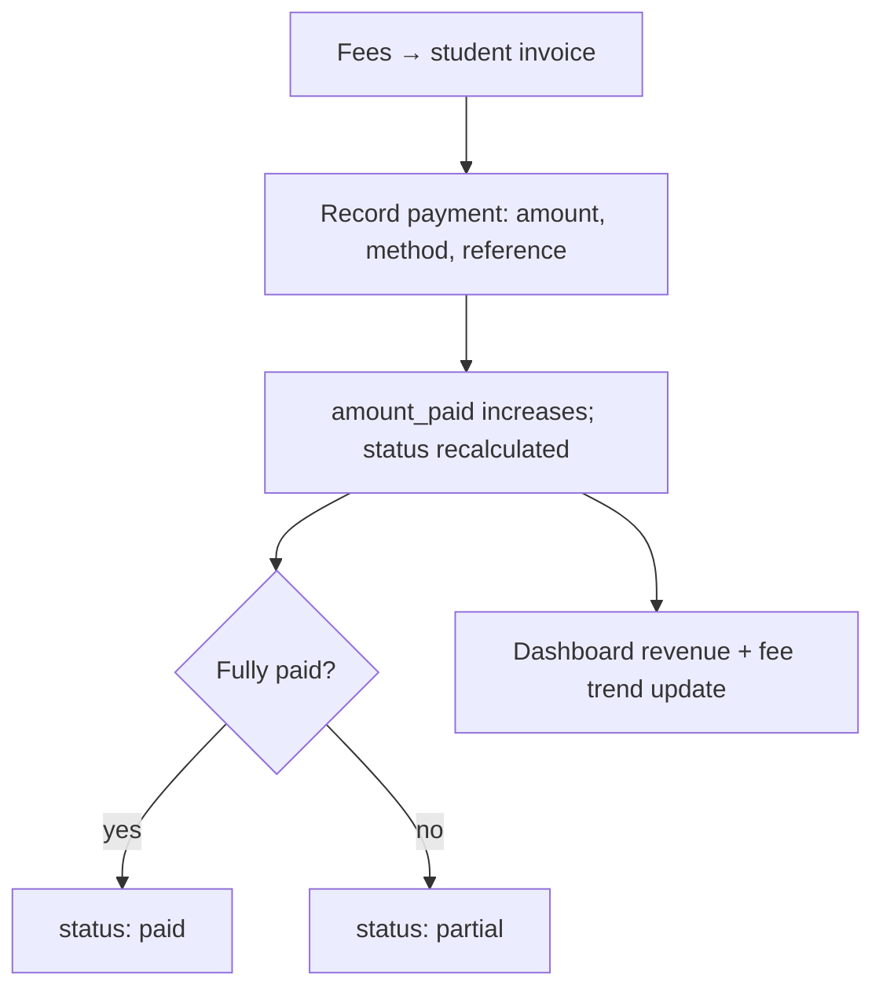
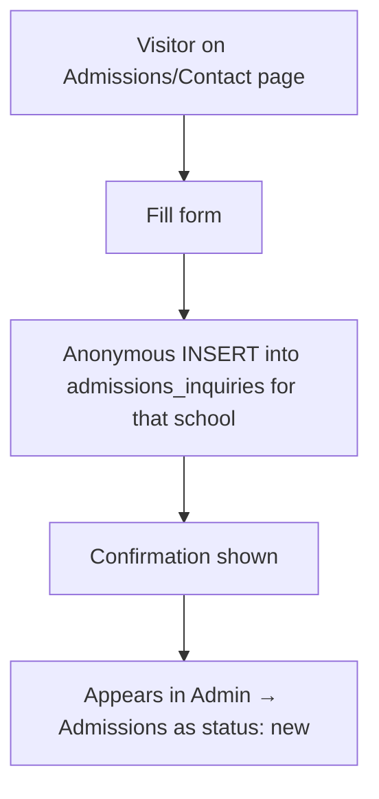

# 05 — User Flows

Version 1.1 · Status: reflects the wired backend

The key journeys each role takes. Flows assume the tenancy and permission rules in
`docs/04-AUTH-AND-PERMISSIONS.md`.

---

## 1. School setup (school_admin, first run)

The critical path from an empty school to an operational one.



Ordering matters: years/terms and classes/subjects must exist before students can be enrolled
and teachers assigned. The dashboard's empty states guide the admin through missing setup.

---

## 2. Admin: create a student

```mermaid
flowchart TD
    A[Students → New] --> B[Enter details: name, DOB, gender, admission no, photo]
    B --> C[Select class → creates enrollment for active year]
    C --> D[Assign parent(s) or defer]
    D --> E[Save]
    E --> F{Valid?}
    F -- no --> B
    F -- yes --> G[Student appears in list; activity logged]
```

Admission number is unique per school. Assigning a class creates the `enrollments` row for the
active academic year.

---

## 3. Admin: handle an admissions inquiry



---

## 4. Teacher: mark attendance

```mermaid
flowchart TD
    A[Teacher dashboard → Attendance] --> B[Select class (own only)]
    B --> C[Select date (defaults today)]
    C --> D[Roster loads with current statuses]
    D --> E[Mark each: Present / Absent / Late]
    E --> F[Save]
    F --> G{RLS: assigned to class?}
    G -- no --> H[Rejected]
    G -- yes --> I[Attendance upserted; percentages update]
```

Re-opening the same class+date loads existing marks for editing (upsert on `(student, date)`).

**Downstream (one write, many views).** The save writes `attendance` only, then invalidates the
`attendance` keys. Everything else re-derives from those rows: the **parent** child sees an updated
attendance history + percentage (`student_attendance_summary`); the **admin** class register and
the school-wide attendance rate in `dashboard_stats` recompute. Nothing is copied between portals
(`docs/02-ARCHITECTURE.md` §3).

---

## 5. Teacher: enter results

```mermaid
flowchart TD
    A[Grade / Assessment] --> B[Select class + subject (own)]
    B --> C[Select or create an assessment (type, title, max score, term)]
    C --> D[Enter score per student]
    D --> E[Grade auto-derives from grading scale]
    E --> F[Save draft]
    F --> G[Review]
    G --> H[Submit results]
    H --> I{RLS: teacher owns assessment?}
    I -- no --> J[Rejected]
    I -- yes --> K[Results submitted; feed terminal report + parent view]
```

Drafts (`is_submitted = false`) are editable; submitted results are what parents eventually
see (once the terminal report is published).

**Downstream (one write, many views).** Submitting writes `results` (grade derived from
`grade_bands`, never stored twice). Those rows then feed the **admin** terminal-report generation
(totals, average, position) and `class_performance`, and — once the admin publishes the terminal
report — the **parent** results view. Grades are always derived from the current scale, so a scale
change re-grades every view consistently.

---

## 6. Admin: generate & publish terminal reports



Unpublished reports are invisible to parents (RLS checks `is_published`).

---

## 7. Admin: promotion (end of year)



Promotion never mutates historical enrollments — it creates new ones for the next year, so
history and past reports stay intact.

---

## 8. Parent: view a child



Everything a parent sees is filtered by `student_guardians` — they can never reach a child
they aren't linked to. The fees branch is read-only in the database too, not just in the UI: a
parent holds SELECT on `invoices` / `payments` / `extra_fee_assignments` and nothing else, so they
cannot invent a payment against their own child's invoice
(`tests/rls/parent-fees.test.ts` asserts the insert, update and delete all fail).

---

## 9. Fees: record a payment (admin)



---

## 10. Marketing: admissions inquiry (public)



This is the only unauthenticated write path; it is INSERT-only and rate-limited.
